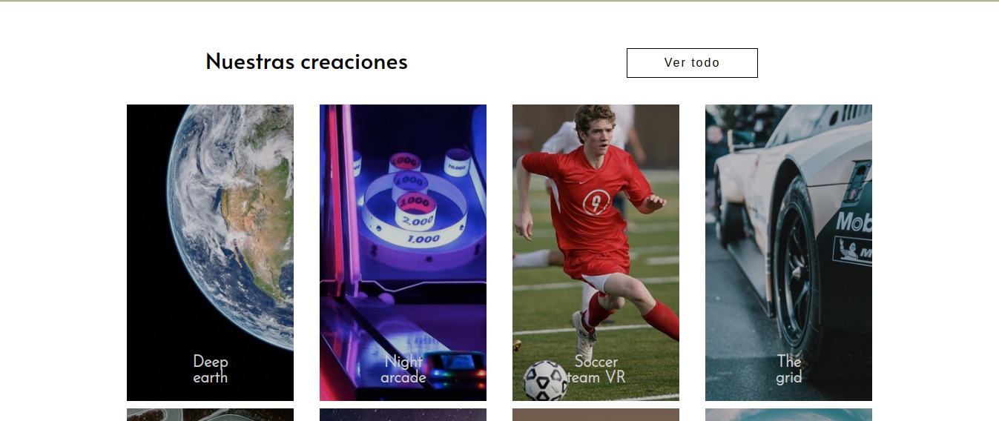

# pagina-de-inicio-de-Loopstudios

## Introducción
Este es un desafío de la plataforma Frontend Mentor, el ejercicio consiste en construir una pagina y lograr que se parezca lo más posible al diseño.

## Objetivos del desafio

- Ver el diseño óptimo para el sitio según el tamaño de pantalla de su dispositivo.
- Ver estados de desplazamiento para todos los elementos interactivos en la página.

## Tecnologías utilizadas
- HTML5
- CSS3
	- GridLayout
	- FlexBox
- SASS
- JavaScript
- Webpack

## Imágenes del proyecto

